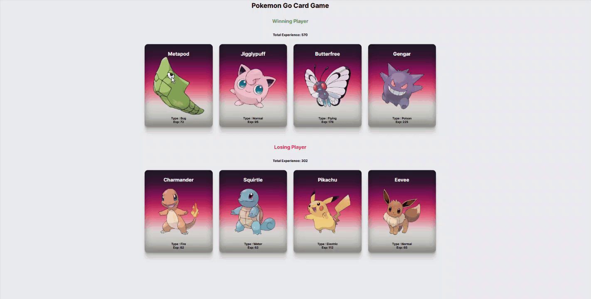

# react-pokedex

#### React ile geliştirildi. Html ve css kullanılarak tasarlandı.

## Gif



## Projenin Çalıştırılması
Proje indirildikten sonra, 'Visual Studio Code' editörü ile proje dizini açılır.

  Terminalde;
```
npm install

```
komut satırı ile projede kullanılan paketler "node_modules" klasöründe oluşturur.
```
npm start
```
komutu ile proje çalışır hale gelir.
